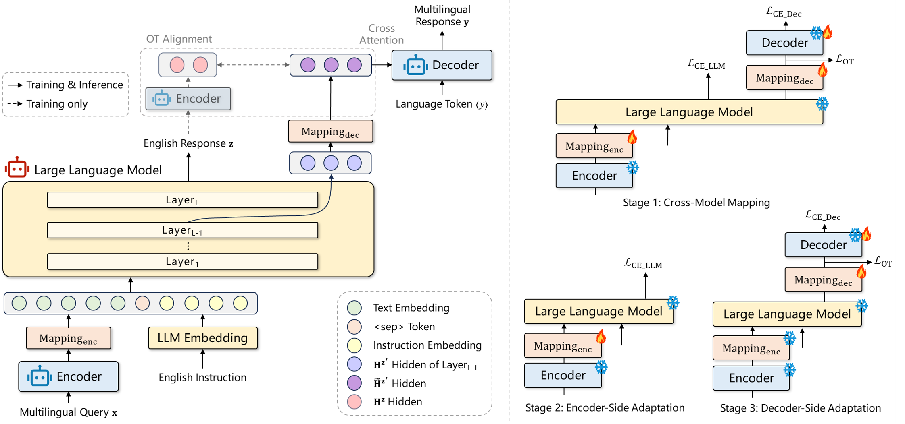

# BayLing-MLingual: One Model, 50 Languages, 2500 Cross-lingual Pairs

> [Mengyu Bu](https://bingo123122121.github.io/), [Yang Feng](https://people.ucas.edu.cn/~yangfeng?language=en)

[](https://arxiv.org/abs/2603.17512) [](https://github.com/BayLing-Models/BayLing-MLingual) [](https://huggingface.co/BayLing-Models/BayLing-MLingual/tree/main)

**BayLing-MLingual** is a multilingual question-answering model that supports **50 languages** and **2500 cross-lingual pairs**. Built on top of **XBridge**, BayLing-MLingual leverages a compositional Encoder-LLM-Decoder architecture that separates language understanding, knowledge & reasoning, and Language generation. This design enables strong multilingual performance across both high-resource and low-resource languages while preserving the reasoning capabilities of the base LLM.

## 🚀Key Features

* **50 languages and 2500 cross-lingual pairs**: A single model supports 50 languages across diverse language families. Input and output languages can be selected independently.
* **Strong multilingual performance**: BayLing-MLingual preserves the reasoning and knowledge capabilities of the underlying LLM while extending multilingual understanding and generation.
* **Low-resource & unseen language transfer**: BayLing-MLingual demonstrates strong performance on high-resource languages, low-resource languages and previously unseen languages, without retraining the LLM.
* **Efficient Deployment**: Only lightweight multilingual modules are added on top of the LLM.

## 💬 Example Interactions

### Japanese → Swahili

**Question**

```
地球は丸いですか？
```

**Answer**

```
Ndiyo. Dunia ni mviringo.
```

### Arabic → Chinese

**Question**

```
أين تقع عاصمة الصين؟
```

**Answer**

```
中国的首都是北京。
```

### Bengali → German

**Question**

```
সূর্য কেন উজ্জ্বল?
```

**Answer**

```
Die Sonne leuchtet aufgrund der Kernfusion im Sonnenkern.
```

## 🌐Supported Languages

| Code | Language    |
| ---- | ----------- |
| en   | English     |
| zh   | Chinese     |
| ja   | Japanese    |
| de   | German      |
| fr   | French      |
| es   | Spanish     |
| ru   | Russian     |
| sw   | Swahili     |
| bn   | Bengali     |
| th   | Thai        |
| af   | Afrikaans   |
| ar   | Arabic      |
| az   | Azerbaijani |
| cs   | Czech       |
| el   | Greek       |
| et   | Estonian    |
| fa   | Persian     |
| fi   | Finnish     |
| gl   | Galician    |
| gu   | Gujarati    |
| he   | Hebrew      |
| hi   | Hindi       |
| hr   | Croatian    |
| id   | Indonesian  |
| it   | Italian     |
| ka   | Georgian    |
| kk   | Kazakh      |
| km   | Khmer       |
| lt   | Lithuanian  |
| lv   | Latvian     |
| mk   | Macedonian  |
| ml   | Malayalam   |
| mn   | Mongolian   |
| mr   | Marathi     |
| my   | Burmese     |
| ne   | Nepali      |
| nl   | Dutch       |
| pl   | Polish      |
| ps   | Pashto      |
| pt   | Portuguese  |
| ro   | Romanian    |
| sl   | Slovenian   |
| sv   | Swedish     |
| ta   | Tamil       |
| te   | Telugu      |
| tr   | Turkish     |
| uk   | Ukrainian   |
| ur   | Urdu        |
| vi   | Vietnamese  |
| xh   | Xhosa       |

## 🛠️Quick Start

### 1. Prepare Environment

``` shell
git clone https://github.com/BayLing-Models/BayLing-MLingual.git
cd BayLing-MLingual
conda create -n bayling-mlingual python=3.9.12
conda activate bayling-mlingual
pip install -r requirements.txt
```

### 2. Download Model

We release `BayLing-MLingual` on [Hugging Face](https://huggingface.co/BayLing-Models/BayLing-MLingual).

### 3. Launch Gradio Demo

``` shell
gradio_demo=demo.py
mt_tokenizer_path=/path/to/your/nllb-1.3b
llm_tokenizer_path=/path/to/your/llama3-8b
model_path=/path/to/our/hf/model

CUDA_VISIBLE_DEVICES=0 python $gradio_demo \
    --model_path $model_path \
    --mt_tokenizer_path $mt_tokenizer_path --llm_tokenizer_path $llm_tokenizer_path \
    --max_gen_len 256
```

## 🔬Technical Report

BayLing is built upon **XBridge**. For architecture details, training methodology, and experimental analysis: see [XBridge repository](https://github.com/ictnlp/XBridge) and [ACL 2026 paper](https://arxiv.org/abs/2603.17512).



## ⚖️LICENSE

Our code is released under the Apache-2.0 License. Our model is intended for academic research purposes only and may **NOT** be used for commercial purposes.

You are free to use, modify, and distribute this model in academic settings, provided that the following conditions are met:

* **Non-commercial use**: The model may not be used for any commercial purposes.
* **Citation**: If you use this model in your research, please cite the original work.

### ❗Commercial Use Restriction
For any commercial use inquiries or to obtain a commercial license, please contact `fengyang@ict.ac.cn`.


## 📚Citation

If you have any questions, please feel free to submit an issue or contact `bumengyu23z@ict.ac.cn`. 

If you find this repository useful, please star this repository and cite our paper:

```tex
@misc{bu2026languagedemandknowledgecore,
      title={Language on Demand, Knowledge at Core: Composing LLMs with Encoder-Decoder Translation Models for Extensible Multilinguality}, 
      author={Mengyu Bu and Yang Feng},
      year={2026},
      eprint={2603.17512},
      archivePrefix={arXiv},
      primaryClass={cs.CL},
      url={https://arxiv.org/abs/2603.17512}, 
}
```


